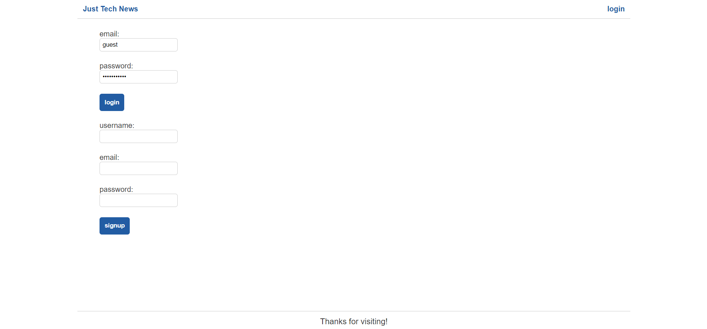

# Just Tech News

## Description
A minimalist social media application inspired by Hacker News that allows a user to post an article from another source and other users vote or comment on the post.   

##### Homescreen

##### Login Pageiew

##### Create Post

Visit site [here](https://just-tech-news-xo.herokuapp.com/)

## Table of Contents
  * [Installation](#installation)
  * [Usage](#usage)
  * [License](#license)
  * [Technologies](#technologies)
  * [Contributing](#contributing)
  * [Testing](#testing)
  * [Questions](#questions)
  
## Installation
Clone project to a directory on your local machine and cd into just-tech-news directory.  Run <$ npm install> to install dependencies.  See package.json for other available scripts.

## Usage
Run <$ npm start> to launch application on localhost development server.  View posts.  Create a user account.  Add posts.  Vote on other posts. 

## License 
This project is covered under the MIT license 

## Technologies 
Node.js, Express, MySQL, Sequelize, Handlebars.js

## Contributing
To see the guidelines adopted for contributing to this project, please view the [Contributor Covenant](https://www.contributor-covenant.org/version/2/0/code_of_conduct/code_of_conduct.txt)

## Testing
Tests coming soon

## Questions
Visit me at GitHub  
[christopherConcannon](https://github.com/christopherConcannon)
  
If you have any questions or would like to contact me, please email me at  
[cmcon@yahoo.com](mailto:cmcon@yahoo.com)
